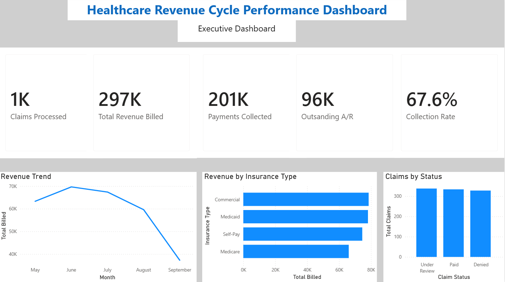
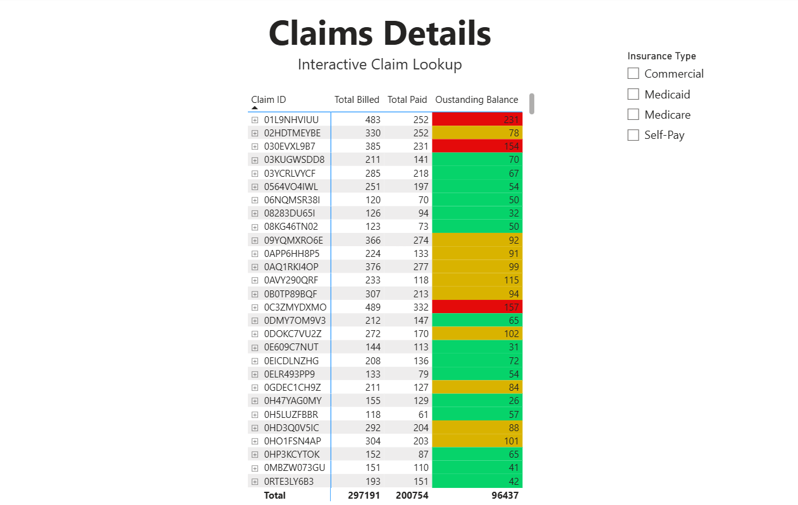
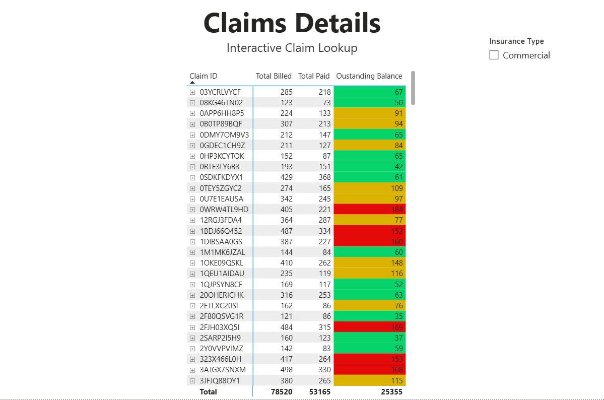

# Healthcare Revenue Cycle Performance Dashboard

## Overview

This project showcases an interactive Power BI dashboard designed to analyze healthcare revenue cycle performance. The dashboard provides healthcare leaders with a centralized view of financial and operational KPIs, enabling data-driven decisions related to claims management, collections, insurance performance, and revenue optimization.

---

## Dashboard Preview

### Executive Dashboard

---

### Interactive Claims Details

---

### Commercial Claims Drill-Through

---

## Business Problem

Healthcare organizations manage thousands of insurance claims and revenue transactions each month. Without centralized reporting, it becomes difficult to monitor collection performance, identify outstanding balances, evaluate payer performance, and investigate claim-level issues quickly.

This dashboard provides executive-level visibility while allowing users to drill into detailed claims for deeper financial analysis.

---

## Project Objectives

- Monitor key revenue cycle KPIs
- Analyze monthly revenue trends
- Compare performance across insurance types
- Track claims by processing status
- Review outstanding accounts receivable
- Enable interactive claim-level drill-through analysis
- Support data-driven financial decision-making

---

## Dashboard Features

- Executive KPI scorecards
- Revenue trend visualization
- Insurance mix analysis
- Claims status reporting
- Interactive slicers
- Conditional formatting
- Drill-through navigation
- Claim-level financial analysis

---

## Key Insights

- Total Revenue Billed reached **$297K**.
- Payments Collected totaled **$201K**, resulting in a **67.6% Collection Rate**.
- Outstanding Accounts Receivable totaled **$96K**, highlighting opportunities to improve collections.
- Commercial and Medicaid generated the highest billed revenue.
- Interactive drill-through functionality enables investigation of individual claims and outstanding balances.

---

## Business Recommendations

- Prioritize collection efforts for high outstanding balance claims.
- Monitor payer performance to improve reimbursement efficiency.
- Reduce claim processing delays through proactive claim monitoring.
- Review collection trends monthly to improve cash flow.
- Utilize executive dashboards during revenue cycle performance meetings.

---

## Skills Demonstrated

- Dashboard Development
- Healthcare Revenue Cycle Analytics
- Executive KPI Reporting
- Business Intelligence (BI)
- Data Visualization
- Power BI
- Power Query
- DAX
- Interactive Reporting
- Drill-Through Analysis

---

## Files Included

- Healthcare Revenue Cycle Performance Dashboard.pbix
- Healthcare_Revenue_Cycle_Case_Study.pdf
- Executive_Dashboard.png
- Interactive_Claims_Details.png
- Commercial_Claims_Drill_Through.png

---

## Prepared By

**Zayna Thompson**
